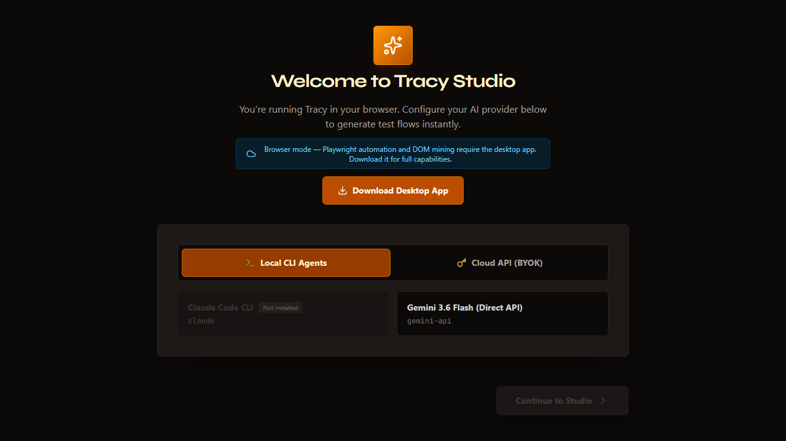

# Tracy — E2E Browser Testing IDE

[](LICENSE)
[]()
[]()
[]()
[]()

> **Desktop-first AI-powered testing studio** that lets you design, edit, and run E2E browser tests through YAML flows — with no coding required. Try it in your browser or download the full desktop app for Playwright automation.

---

## Screenshots

| Studio View | YAML Editor | AI Copilot |
|-------------|-------------|------------|
|  |  |  |

> **Tip:** Run `pnpm capture-screenshots` to regenerate all screenshots from a live Tracy instance.

---

## What is Tracy?

Tracy is an intelligent test authoring environment that bridges the gap between manual QA exploration and automated E2E testing. Instead of writing Selenium or Cypress scripts by hand, you describe what you want to test in natural language, and Tracy's AI layer synthesizes validated test flows in its own YAML format.

### Why Tracy?

- **No-code test authoring** — Describe user actions in plain English; Tracy generates structured YAML
- **Live DOM mining** — Capture element trees from any page; get selector suggestions automatically
- **Visual step editor** — See your tests as a timeline with status indicators
- **Multi-browser support** — Run against Chromium, Firefox, or WebKit via Playwright
- **Dual deployment** — Use in-browser for editing & planning, switch to desktop for execution

---

## Features

| Feature | Web Mode | Desktop Mode |
|---------|----------|--------------|
| YAML Test Editing | ✅ | ✅ |
| Visual Step Editor | ✅ | ✅ |
| AI Flow Generation | ✅ (HTTP) | ✅ (CLI / Direct) |
| Simulated Execution | ✅ | ✅ |
| Real Browser Automation | ❌ | ✅ (Playwright) |
| DOM Mining | Preview only | ✅ Full capture |
| File System Operations | IndexedDB | ✅ Native FS |
| Element Inspector | ❌ | ✅ |
| Screenshot Capture | ❌ | ✅ |

---

## Installation

### Desktop App (Recommended)

Full feature set with Playwright automation.

```bash
git clone https://github.com/latiosthinh/tracy.git
cd tracy
pnpm install
pnpm dev              # Start Electron + Vite dev server
pnpm build            # Build production installer
```

### Web Version (Try Without Installing)

Edit flows, generate tests with AI, and simulate executions directly in your browser.

```bash
git clone https://github.com/latiosthinh/tracy.git
cd tracy
pnpm install
pnpm dev:web          # Vite dev server on :5174
pnpm build:web        # Static output in dist-web/
```

Deploy the web build to any static host (Vercel, Netlify, GitHub Pages) and optionally pair it with the Express AI backend (`src/server/`).

---

## Quick Start

1. **Configure your AI provider** — Select Gemini direct API or BYOK model
2. **Create a project** — Set your target URL and choose a template
3. **Generate flows** — Click "Ask AI" to produce test steps from a natural-language description
4. **Edit manually** — Adjust selectors, add assertions, rearrange steps in the YAML editor
5. **Simulate** — Watch steps execute with animated timelines in the renderer
6. **Run for real** — Open the desktop app for Playwright-driven browser automation

---

## Tech Stack

```
Renderer:   React 19 + Vite + TypeScript + Zustand + Tailwind v4
Desktop:    Electron + contextIsolation + IPC bridge
Engine:     playwright-core (embedded)
AI Layer:   @google/genai (Gemini) + extensible agent provider system
Storage:    js-yaml (parsing), Dexie / IndexedDB (web), native FS (desktop)
DevOps:     pnpm, ESLint, Vitest, tsx
```

---

## Architecture

```
┌─────────────────────┐        ┌──────────────────┐
│ Browser Client      │        │ AI Backend       │
│ (React + Zustand)   │◄────►│ (Express/Vercel) │
│                     │ HTTP   │                  │
│ • YAML Editor       │        │ • generate-flow  │
│ • Visual Step Ed.   │        │ • auto-suite     │
│ • Sim Runner        │        │ • Gemini SDK     │
│ • IndexedDB (Dexie) │        └──────────────────┘
└─────────────────────┘

┌─────────────────────────────────┐
│ Electron Main Process           │
│                                 │
│  IPC Bridge ──► Playwright Engine │
│               ──► DOM Miner     │
│               ──► CLI Agents    │
│               ──► File System   │
└─────────────────────────────────┘
```

See [public/screenshots/architecture.svg](public/screenshots/architecture.svg) for the detailed architecture diagram.

---

## Project Structure

```
tracy/
├── electron/              # Electron main process
│   ├── main.ts            # Window management entry point
│   ├── preload.ts         # Secure IPC bridge (contextIsolation)
│   └── ipc/               # IPC channel handlers
│       ├── playwrightEngine.ts
│       ├── webviewManager.ts
│       └── fileSystem.ts
├── src/                   # React renderer
│   ├── components/        # UI components
│   │   ├── studio/        # StudioView, RealBrowserView, etc.
│   │   ├── editor/        # YamlEditor, VisualStepEditor
│   │   ├── ai/            # AiCopilot, AgentSelector
│   │   ├── projects/      # ProjectManager, ExportImportPanel
│   │   └── setup/         # WelcomeSetup
│   ├── stores/            # Zustand state stores
│   │   ├── projectStore.ts
│   │   ├── executionStore.ts
│   │   └── uiStore.ts
│   ├── lib/               # Shared utilities
│   │   ├── ipc.ts         # Type-safe client wrapper
│   │   ├── db.ts          # Dexie schema
│   │   └── export.ts      # Serialization helpers
│   └── hooks/             # React hooks
│       └── useEnvironment.ts
├── api/                   # Vercel serverless functions
│   ├── generate-flow.ts
│   └── auto-suite.ts
├── scripts/               # Utilities
│   └── capture-screenshots.ts
├── vite.web.config.ts     # Web-only Vite build
├── vercel.json            # Vercel deployment config
└── docs/                  # Documentation
    └── FLOW_SCHEMA.md
```

---

## Configuration

### Environment Variables

| Variable | Description | Required |
|----------|-------------|----------|
| `GEMINI_API_KEY` | Google Gemini API key for flow generation | Yes (BYOK mode) |
| `OPENAI_API_KEY` | OpenAI key (if using GPT-based agents) | No |
| `ANTHROPIC_API_KEY` | Anthropic key (if using Claude-based agents) | No |
| `SERVER_PORT` | Express server port (default: 3001) | No |
| `DISABLE_HMR` | Set to `true` to disable Vite HMR | No |

### YAML Flow Schema

Test flows follow the schema defined in [docs/FLOW_SCHEMA.md](docs/FLOW_SCHEMA.md).

Supported commands: `navigate`, `leftClick`, `rightClick`, `hover`, `scroll`, `tap`, `twoFingersTap`, `press`, `fill`, `waitFor`.

---

## Contributing

Contributions are welcome! Here are some areas that could use help:

- 🎨 Screenshot capture improvements
- 🔌 New AI provider integrations (OpenAI, Anthropic)
- 🧪 More unit / integration tests
- 📝 Translation / i18n support
- 🖼️ Additional device presets for responsive testing

Please open an issue or PR following the standard contribution guidelines.

---

## Credits

Tracy was built with:

- **React** — UI framework
- **Electron** — Desktop container
- **Playwright** — Browser automation engine
- **Google GenAI** — AI flow synthesis
- **Zustand** — State management
- **Tailwind CSS** — Styling

The cyberpunk amber/cyan theme pays homage to the best terminal aesthetics of the future. 🖤

---

<div align="center">
  <sub>Built with ❤️ for quality assurance engineers everywhere</sub>
</div>
